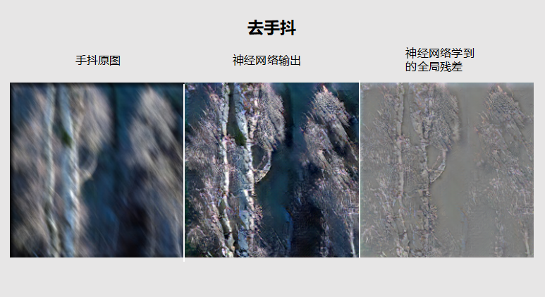
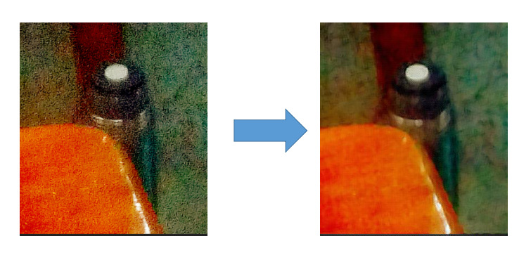
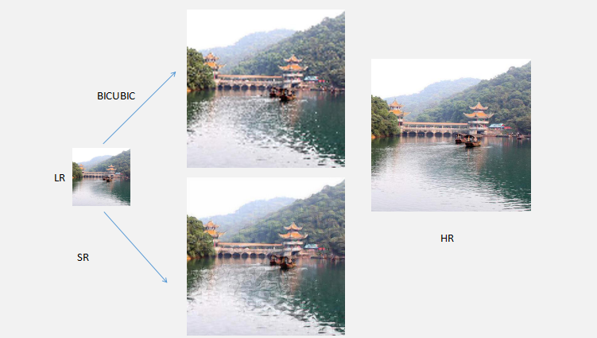

# Elegance
A deeplearning application of mobile photography

## INFO

### What is Elegance

elegance 是一个专门针对手机摄影手残党开发的一款深度学习应用，其目的是降低美图门槛，通过生成模型尽可能的完成一些基础视觉特效。目前已经支持：

- 去抖动
- 去放大导致的失真
- 自然图片的4倍超分辨率重建
- 人脸图片的4倍超分辨率重建

特色：

- 采用小模型
- 使用卷积和转置卷积完成，对待处理的图片的尺寸无要求
- 使用插件机制，一切功能皆插件，用户可自定义插件（欢迎PR回来）

### Version

- **0.2.0**

- Update：

              1. 原去除motion blur的插件deblur改成了deblur
              2. 完善了插件的机制，改变了命令行参数格式，现可为插件定制和传递参数，格式如```python elegence plguin_name input_img -p key1=value1 key2=value2   ...```
              3. 去除了facesr，facesr4，sr，sr4等插件，增加enhance插件
              4. 增加了目录内多张图片处理。

- *注意：目前版本插件接口等和 0.1.0版本不兼容*

## How to Use

目前Elegance只有命令行界面，视发展情况会决定是否开发GUI（毕竟对于我个人来说命令行够用了）
```
usage: elegance.py [-h] [--output OUTPUT] [-p [PARAMS [PARAMS ...]]]
                   [-split SPLIT] [-c] [-dir]
                   {demotion,denoise,sr} input

elegance

positional arguments:
  {demotion,denoise,sr}
                        the name of plugin you need to use
                        (options:['demotion', 'denoise', 'sr'])
  input                 the path of image you need to process

optional arguments:
  -h, --help            show this help message and exit
  --output OUTPUT       the path of image you processed(default=output.jpg)
  -p [PARAMS [PARAMS ...]], --params [PARAMS [PARAMS ...]]
                        the params of plugin
  -split SPLIT          the size of image need to split,like 256 default
                        np.inf
  -c, --combine         whether combine the origin image and processed image
  -dir                  whether dir the path your input
```

### Example 

与训练模型请到release tag上下载，只需放到对应的目录下即可

- **Demotion** 

``maxsize`` 参数  图片最大尺寸，超出该尺寸的图片会按比例规整到该尺寸下，默认为1380

Example

 

- **Denoise** 

``maxsize`` 参数 图片最大尺寸，超出该尺寸的图片会按比例规整到该尺寸下，默认为1380

Example



- **Enhance**

1. ```up```参数，将图片变大，可视为超分,理论上可无穷整数倍数放大，但为了性能考虑建议up <= 4,默认值为1

2. ``maxsize`` 参数 图片最大尺寸，超出该尺寸的图片会按比例规整到该尺寸下，默认为1380

3. ```blur``` 是否再进入神经网络前进行滤波处理，默认为```None```,可选值有```g```代表高斯模糊，```m``` 代表中值模糊，```r```参数代表上述操作的核的半径，默认为5。，

Example：



## Denpendent

- pillow
- numpy
- python 3.6+
- pytorch 0.3.0

## TODO

- [x] 去抖动
- [x] 去放大导致的失真
- [x] 自然图片的4倍超分辨率重建
- [x] 人脸图片的4倍超分辨率重建
- [ ] 视频模块
- [ ] 换脸
- [ ] 增强上述已完成的性能

 想到再更


## 资助作者给黄老板家里送钱（买GPU）

  


本项目会长期维护，捐款名单会周期更新，名字取支付宝ID的的最后一位，如郭靖和黄蓉，则是*蓉 捐款1元，谢谢各位朋友。


## LICENSE

MIT  