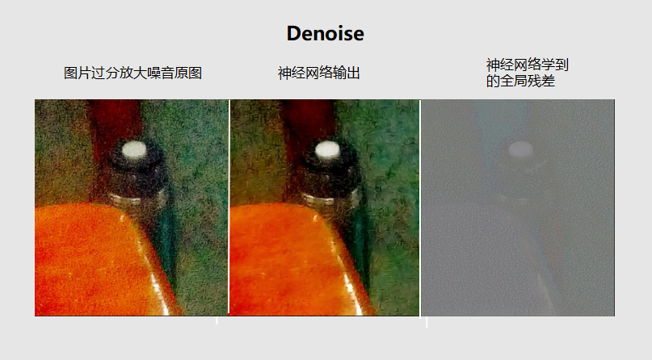
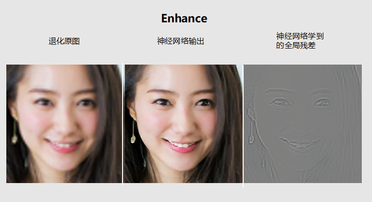

# Elegance
A deeplearning application of mobile photography

## What is Elegance

elegance 是一个专门针对手机摄影手残党开发的一款深度学习应用，其目的是降低美图门槛，通过生成模型尽可能的完成一些基础视觉特效。目前已经支持：

- 去抖动
- 去放大导致的失真
- 自然图片的4倍超分辨率重建
- 人脸图片的4倍超分辨率重建

特色：

- 采用小模型
- 使用卷积和转置卷积完成，对待处理的图片的尺寸无要求
- 使用插件机制，一切功能皆插件，用户可自定义插件（欢迎PR回来）


## How to Use

目前Elegance只有命令行界面，视发展情况会决定是否开发GUI（毕竟对于我个人来说命令行够用了）
```
usage: elegance.py [-h] [--input INPUT] [--output OUTPUT]
                   [-p {blur,denoise,facesr4,facesr4vgg,sr4}] [-c]

elegance

optional arguments:
  -h, --help            show this help message and exit
  --input INPUT         the path of image you need to
                        process(default=input.jpg)
  --output OUTPUT       the path of image you processed(default=output.jpg)
  -p {blur,denoise,facesr4,sr4}, --plugin {blur,denoise,facesr4,facesr4vgg,sr4}
                        the name of plugin you need to use (options:['blur',
                        'denoise', 'facesr4', 'sr4']
                        default=blur)
  -c, --combine         whether combine the origin image and processed image

```

### example 

与训练模型请到release tag上下载，只需放到对应的目录下即可

- 去抖动模糊

  

- 去过分放大导致的噪点



- 自然图像4倍超分



-  人脸4倍超分


## Denpendent

- pillow
- numpy
- python 3.6+
- pytorch 0.3.0

## TODO

- [x] 去抖动
- [x] 去放大导致的失真
- [x] 自然图片的4倍超分辨率重建
- [x] 人脸图片的4倍超分辨率重建
- [ ] 视频模块
- [ ] 换脸
- [ ] 增强上述已完成的性能

 想到再更


## LICENSE

MIT